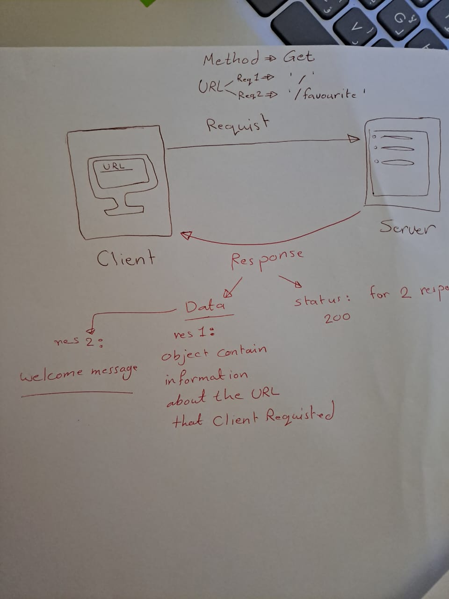

# Movies-Library

# Project Name - Movies-Library

**Author Name**: Walaa Alrefai

## WRRC

## Overview

## Getting Started
<ol>
1. make sure that i have a node.js to run my server 
2.install express:the frame work to built the server 
3.inside the directory type "npm init -y","copy&paste json file",
"npm install express"
 

4.install axios,nodemon,dotenv and got them in my server.js file; 
5.send requist from my server to the 3rd party "API" to get data and make sure i have api-key .
 
6.handle promise in my page if it true then the server well reshape data and send it as response to the client.
else well catch the error and send error details. 
## Project Features 
2 pages :home and favourite page,when client wants to get the home page it response with information about requisted film 
and welcoming message in favourite page well appear when he requisted the path of favourite page.

Today is for handelling 4 route "trending,search,details,language"
and sending the required response  to the client.

<!-- What are the features included in you app -->